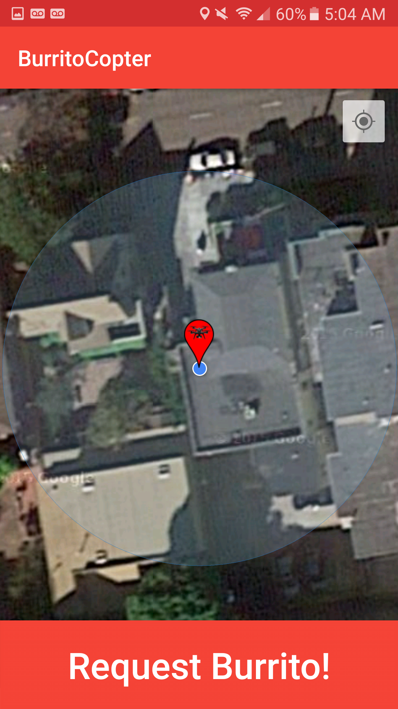

# BurritoSwarm
Delivering burritos in a swarmy fashion

# Installation
Dependencies:
> sudo apt-get install python-pip
> sudo pip install utm
> cp px4_swarm.launch ../../mavros/mavros/launch/
> cp node_swarm.launch ../../mavros/mavros/launch/
> roslaunch solo_sim.launch
> export SOLO_ROS_WS=<PATH_TO_flightcode/ROS_DIR> #ENV VAR used in solo_sim.launch and solo_swarm.launch
> source $SOLO_ROS_WS/devel/setup.bash

